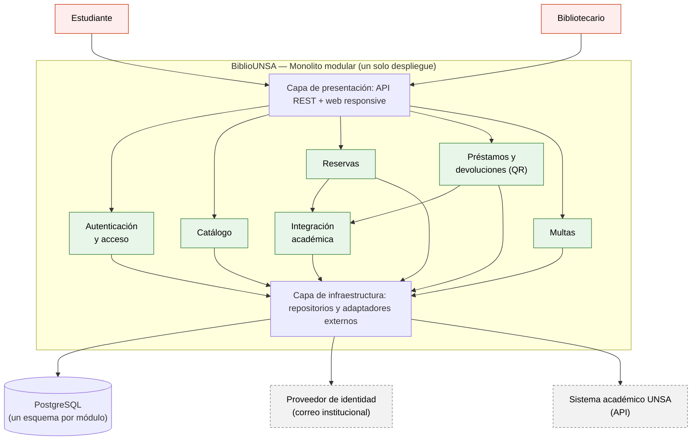

# BiblioUNSA — Laboratorio 04: Fundamentos de arquitectura de software
Construcción de Software · EPIS-UNSA · 2026-B · Grupo XX
 
## Integrantes
| Nombre | Rol en el laboratorio |
|--------|-----------------------|
| Valerio | Analista de drivers y responsable de la matriz de decisión |
| Mijael | Diagramador y redactor de ADR |
| Mauricio | Verificador de IA y responsable de documentación adicional |
 
## Caso
BiblioUNSA es una plataforma para el préstamo y la reserva de libros de las bibliotecas de la UNSA. Los estudiantes consultan el catálogo y reservan libros, y los bibliotecarios registran préstamos y devoluciones con el carné QR y controlan las multas. El sistema valida la matrícula vigente consultando al sistema académico solo mediante su API, sin acceder a su base de datos. El atributo de calidad crítico es la **seguridad e interoperabilidad**: únicamente debe entrar personal y estudiantes de la UNSA con su correo institucional.
 
## Arquitectura elegida
Monolito modular: un solo despliegue, con módulos separados y la integración académica aislada en un adaptador.

## Decisiones arquitectónicas
- [ADR-001: Estilo arquitectónico](docs/architecture/adr/001-estilo-arquitectonico.md)
- [ADR-002: Autenticación](docs/architecture/adr/002-autenticacion.md)
- [ADR-003: Integración Académica](docs/architecture/adr/003-integracion-academica.md)

## Reflexión sobre el uso de la IA (5–8 líneas)
<¿En qué ayudó? ¿Qué errores cometió? ¿Qué aprendimos a verificar?>
